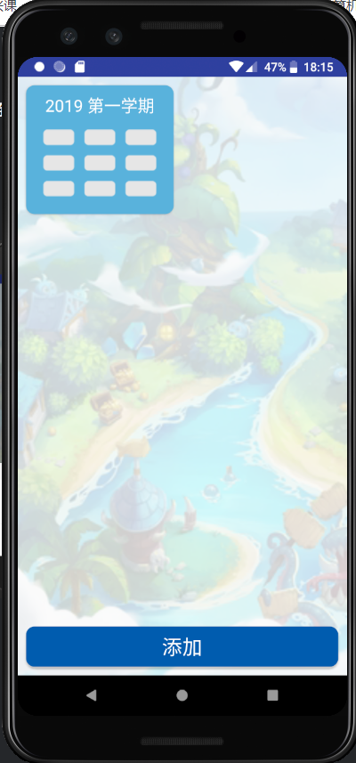
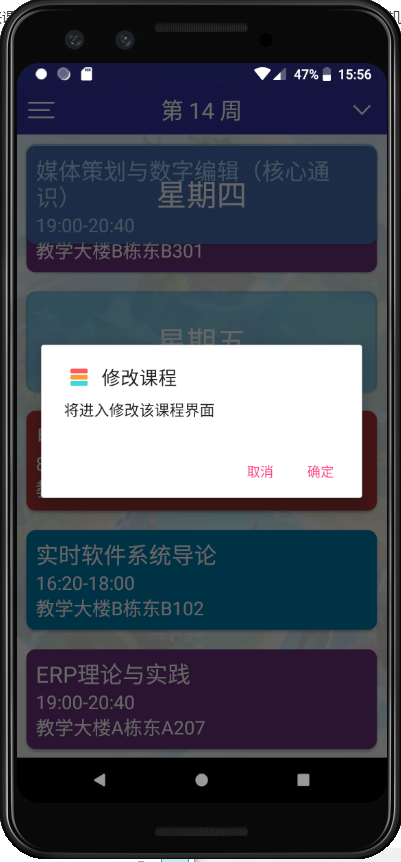
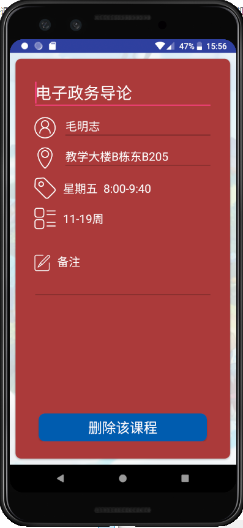

 Course Card 

## 应用简介

Course Card是一款课程表应用。用户可以通过中大教务系统导入课程表，在日常生活中方便地查询每日课程。除此之外，Course Card还有课程提醒功能和备注功能，可以帮助用户合理安排时间。我们还留了一个彩蛋，如果用户足够幸运的话，还有机会在课程信息界面偶遇可爱的冈布奥。

## 需求分析
因为超级课程表现在无法导入中大课程表，所以许多同学只能手动编辑课程信息，非常不方便。我们以此为出发点，设计了一款中大课程表应用——Course Card。我们通过中央身份验证服务获取cookie，再到中大教务系统获取课程表数据。在整个过程中，我们并不获取用户的NetID和密码，因此是非常安全的。而应用中的课程列表采用了卡片的形式，这正是应用名字的由来。

## 使用说明
用户首次打开应用时，课程列表为空，点击左上角的列表按钮弹出菜单选择对应按钮，跳转到学期列表界面。点击下方的添加按钮，弹出学期菜单，选择学期后添加到学期列表。

点击添加的学期，跳转到中央身份验证服务页面，输入NetID和密码，如果身份验证成功就能获取该学期课程信息。再次点击该学期，跳转到课程列表，显示一周之内的课程信息，上下滑动查看，当前日期始终悬浮在顶部。点击右上角下拉菜单，选择周数并跳转。

长按对应的学期可选择删除该该学期课程

点击课程可以查看详细信息，点击横线编辑备注，写好备注之后点击空白区域完成更新。只要该课程添加了备注，在任意一周都可以查看到备注信息。退出应用再次打开时，会自动跳转到当天对应的日期，并在通知栏显示课程提醒。

长按课程可以修改信息或删除课程，修改依据是根据课程id修改，可修改所有内容，返回或删除后自动保存

左上方菜单还有添加新课程按钮，课程允许重复，默认有部分信息，返回后自动创建

最后，用户进入课程信息界面时，有机会见到不同的冈布奥。

## 三层架构

## 技术实现

### 中大课程表访问接口

使用WebView显示中央身份验证服务页面：[在这](https://cas.sysu.edu.cn/cas/login?service=https%3A%2F%2Fuems.sysu.edu.cn%2Fjwxt%2Fapi%2Fsso%2Fcas%2Flogin%3Fpattern%3Dstudent-login)

身份验证成功可以得到cookie，在请求头中添加cookie后，向中大教务系统请求课程数据：[在这](https://uems.sysu.edu.cn/jwxt/student-status/student-info/student-no-schedule)

因为中大教务系统网站更新，该api已在12月1日失效，目前通过网络获取的课表为该repo里的测试用数据[在这](dashboard/new_content/sample)

### 数据库
数据库建立Course表和Note表，分别存储课程信息和备注信息。
Course表属性如下：ID，学期，教师，日期，地点，节数，周数。添加课程时，根据从中大教务系统获取的课程信息添加数据。查询课程时，根据课程信息获取相应数据。查询学期时，获取学期属性为该学期的所有课程。
Note表属性如下：课程，备注。查询备注时，根据备注信息获取相应数据。更新备注时，根据备注内容更新相应数据。

### 列表顶部悬浮效果

在列表顶部位置额外设置一个首部列表项，当列表项滑动时，根据当前日期列表项的位置更新首部列表项的内容和位置，看起来就像日期列表项悬浮在课程列表项之上。
课程提醒
记录关闭应用时，用户最后停留的日期。当下次用户登录时，计算当前日期，跳转到相应列表项，并根据当前时间来发送课程提醒通知。

## DashBoard目录

[查看DashBoard目录](./index.md)

#### 感谢小组成员的帮助， [小组成员](https://github.com/orgs/sysu-coursecard/people)