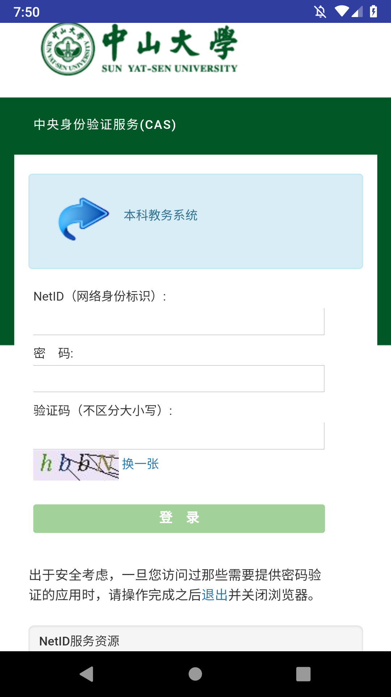

# 个人报告
## 
|  |  | |  |
| :------------: | :-------------: | :------------: | :-------------: |
| 年级 | 16级 | 专业（方向） | 电子政务 |
| 学号 |16340060  | 姓名 |  冯扬|
| 电话 | 18093400839 | Email | 347780452 |

---

## 一、题目

>期末项目 CardCourse 
>一个适合中山大学的课程表app

---

## 二、实现内容

>负责逻辑实现包括数据拉取，通知提醒，日期跳转等

---

## 三、实验结果

### (1)实验截图

### (2)实验步骤以及关键代码

####数据拉取

---

#####原理

> 首先使用webview登录教务系统获取cookie，将cookie加到请求头中请求数据，获取到数据进行json转换，存入数据库。

#####代码实现

>webview 
> URL为中大CAS验证系统，输入NETID会返回cookie，就是我们用来拉取数据的参数

     webView.loadUrl("https://cas.sysu.edu.cn/cas/login?service=https%3A%2F%2Fuems.sysu.edu.cn%2Fjwxt%2Fapi%2Fsso%2Fcas%2Flogin%3Fpattern%3Dstudent-login");
     webView.setWebChromeClient(new WebChromeClient());
     webView.setWebViewClient(new MyWebViewClient(CASActivity.this));
>MyWebViewClient
>需要重写onPageFinished函数,确认获取到cookie后进行跳转，后台加载课表

    public void onPageFinished(WebView view, String url) {
        CookieManager cookieManager = CookieManager.getInstance();
        String CookieStr = cookieManager.getCookie(url);
        Common.cookie = CookieStr;
        if(CookieStr.contains("LYSESSIONID") && CookieStr.contains("user")) {
            Log.d("msg", CookieStr);
            String[] weeklys = {"1,18"};
            for (String i: weeklys)
                Onclick4Data(i,Common.academic);
            Intent intent = new Intent();
            intent.setFlags(Intent.FLAG_ACTIVITY_NO_HISTORY);
            intent.setClass(activity, ListActivity.class);
            try {
                Thread.sleep(1000);
            } catch (InterruptedException e) {
                e.printStackTrace();
            }
            activity.startActivity(intent);
        }
    }
>数据获取及转化
>将json形式的数据转换为所需的格式插入数据库,用到了RXjava、Retrofit 、OkHttpClient 

     final String[] week = weekly.split(",");
	 OkHttpClient build = new OkHttpClient.Builder()
	            .connectTimeout(2, TimeUnit.SECONDS)
	            .readTimeout(2, TimeUnit.SECONDS)
	            .writeTimeout(2, TimeUnit.SECONDS)
	            .build();
	 final Retrofit retrofit = new Retrofit.Builder()
               .baseUrl("https://raw.githubusercontent.com")
               .addConverterFactory(GsonConverterFactory.create())
               .addCallAdapterFactory(RxJava2CallAdapterFactory.create())
               .client(build)
               .build();
     GitHubService gitHubService = retrofit.create(GitHubService.class);
     Observable<JsonRootBean> observable = gitHubService.getRepo(id,week[0],academic);
     observable.subscribeOn(Schedulers.io())
              .observeOn(AndroidSchedulers.mainThread())
              .subscribe(new Observer<JsonRootBean>() {

    @Override
    public void onNext(JsonRootBean jsonRootBean) {
        Log.d("HTTPx", "onNext");
        courses.clear();
        for (int i = 0; i < jsonRootBean.getData().size(); i++) {
            Data data = jsonRootBean.getData().get(i);
            for (int j = Integer.parseInt(week[0]);j < Integer.parseInt(week[1])+1; j++) {
                if (!data.getMonday().equals("null") && data.getSection() % 2 != 0) {
                    String[] temp = data.getMonday().split(",");
                    courses.add(new DBCourse(academic, "星期一", temp[0], temp[1], temp[2], (data.getSection() + 1) / 2, j));
                }
                if (!data.getTuesday().equals("null") && data.getSection() % 2 > 0) {
                    String[] temp = data.getTuesday().split(",");
                    courses.add(new DBCourse(academic, "星期二", temp[0], temp[1], temp[2], (data.getSection() + 1) / 2, j));
                }
                if (!data.getWednesday().equals("null") && data.getSection() % 2 > 0) {
                    String[] temp = data.getWednesday().split(",");
                    courses.add(new DBCourse(academic, "星期三", temp[0], temp[1], temp[2], (data.getSection() + 1) / 2, j));
                }
                if (!data.getThursday().equals("null") && data.getSection() % 2 > 0) {
                    String[] temp = data.getThursday().split(",");
                    courses.add(new DBCourse(academic, "星期四", temp[0], temp[1], temp[2], (data.getSection() + 1) / 2, j));
                }
                if (!data.getFriday().equals("null") && data.getSection() % 2 > 0) {
                    String[] temp = data.getFriday().split(",");
                    courses.add(new DBCourse(academic, "星期五", temp[0], temp[1], temp[2], (data.getSection() + 1) / 2, j));
                }
            }
        }
    }
    @Override
    public void onError(Throwable e) {
        e.printStackTrace();
        Toasty.error(activity, "获取数据失败", Toast.LENGTH_LONG).show();
    }
    @Override
    public void onComplete() {
        Utils.insert(activity,courses);
        Common.statecode = "OK";
    }
	});
	}
	
---

####通知提醒

---

##### 原理

>获取当前日期，查询对应时间的课程，提醒剩余时间，对周末和无剩余课程特殊处理

#####代码实现
>传入参数为当前星期卡片的起始位置和终止位置

    private void NotificationInit(int start, int end) {
    String id = "my_channel_01";
    String name = "课程提醒";
    String messege = "这是一个课程提醒";
    int next_hour = 0,next_minute = 0;

    getTime();
    Log.d("week: ",week+" "+start +" "+ end);
    if (start > 0 && end <= 0)
        end = adapter.getItemCount();
    if (start == -1 ) {
        messege = "周末不如去图书馆看看";
    } else {
        for (int i = start+1; i < end ; i++) {
            Course course = adapter.getItem(i);
            switch (course.getTime()*2 -1) {
                case 1:
                    next_hour = 8 - hour;
                    next_minute = 0 - minute;
                    break;
                case 2:
                    next_hour = 8 - hour;
                    next_minute = 55 - minute;
                    break;
                case 3:
                    next_hour = 10 - hour;
                    next_minute = 0 - minute;
                    break;
                case 4:
                    next_hour = 10 - hour;
                    next_minute = 55 - minute;
                    break;
                case 5:
                    next_hour = 14 - hour;
                    next_minute = 20 - minute;
                    break;
                case 6:
                    next_hour = 15 - hour;
                    next_minute = 20 - minute;
                    break;
                case 7:
                    next_hour = 16 - hour;
                    next_minute = 20 - minute;
                    break;
                case 8:
                    next_hour = 17 - hour;
                    next_minute = 10 - minute;
                    break;
                case 9:
                    next_hour = 19 - hour;
                    next_minute = 0 - minute;
                    break;
                case 10:
                    next_hour = 19 - hour;
                    next_minute = 55 - minute;
                    break;
                default:
                    break;
            }
            Log.i("time", "NotificationInit: " + next_hour + next_minute);
            if (next_hour > 0||(next_hour == 0 && next_minute > 0)) {
                if (next_hour > 0 && next_minute > 0) {
                    messege = "距"+ course.getName() +"还有" + next_hour+"小时"+next_minute + "分钟";
                } else if (next_hour > 1 && next_minute < 0) {
                    messege = "距"+ course.getName() +"还有" + (next_hour-1)+"小时"+(60+ next_minute) + "分钟";
                } else  if (next_hour == 1 && next_minute < 0) {
                    messege = "距"+ course.getName() +"还有" +(60+ next_minute) + "分钟";
                } else {
                    messege = "距" + course.getName() + "还有" + next_minute + "分钟";
                }
                break;
            } else {
                messege = "今天无剩余课程";
            }
        }
    }

    notificationManager = (NotificationManager) getSystemService(NOTIFICATION_SERVICE);
    Notification notification = null;
    if (Build.VERSION.SDK_INT >= Build.VERSION_CODES.O) {
      NotificationChannel mChannel = new NotificationChannel(id, name, NotificationManager.IMPORTANCE_LOW);
      Log.i("channel", mChannel.toString());
      notificationManager.createNotificationChannel(mChannel);
      notification = new Notification.Builder(this)
              .setChannelId(id)
              .setContentTitle("课程提醒")
              .setContentText(messege)
              .setSmallIcon(R.drawable.icon_round_gray).build();
    } else {
      NotificationCompat.Builder notificationBuilder = new NotificationCompat.Builder(this)
              .setContentTitle("课程提醒")
              .setContentText(messege)
              .setSmallIcon(R.mipmap.ic_launcher)
              .setOngoing(true);
      notification = notificationBuilder.build();
    }
    notificationManager.notify(1, notification);
    }

>获取当前星期卡片的位置，因为星期卡片是一个比较特殊的课程卡片，作为查询的起点

	   private int getItemPosition(int week) {
		  int position = -1;
		   String weekday = "星期一";
		   switch (week) {
		     case 1:
		       weekday = "星期日";
		       break;
		     case 2:
		       weekday = "星期一";
		       break;
		     case 3:
		       weekday = "星期二";
		       break;
		     case 4:
		       weekday = "星期三";
		       break;
		     case 5:
		       weekday = "星期四";
		       break;
		       case 6:
		           weekday = "星期五";
		           break;
		       case 7:
		           weekday = "星期六";
		           break;
		     default:
		       weekday = "星期日";
		       break;
		   }
		   for (int i = 0 ; i < Mcourse.size() ; i++) {
		     if (Mcourse.get(i).getWeekday().equals(weekday)) {
		       position = i;
		       break;
		     }
		   }
		   return position;
	  }
	  
 ---
 
####日期跳转

---

    private void smoothMoveToPosition(RecyclerView mRecyclerView, final int position) {
    // 第一个可见位置
    int firstItem = mRecyclerView.getChildLayoutPosition(mRecyclerView.getChildAt(0));
    // 最后一个可见位置
    int lastItem = mRecyclerView.getChildLayoutPosition(mRecyclerView.getChildAt(mRecyclerView.getChildCount() - 1));

    if (position < firstItem) {
        // 如果跳转位置在第一个可见位置之前，就smoothScrollToPosition可以直接跳转
        if (week >1 && week < 6 )
        mRecyclerView.smoothScrollToPosition(position);
    } else if (position <= lastItem) {
        // 跳转位置在第一个可见项之后，最后一个可见项之前
        // smoothScrollToPosition根本不会动，此时调用smoothScrollBy来滑动到指定位置
        int movePosition = position - firstItem;
        if (movePosition >= 0 && movePosition < mRecyclerView.getChildCount()) {
            int top = mRecyclerView.getChildAt(movePosition).getTop();
            mRecyclerView.smoothScrollBy(0, top);
        }
    } else {
        // 如果要跳转的位置在最后可见项之后，则先调用smoothScrollToPosition将要跳转的位置滚动到可见位置
        // 再通过onScrollStateChanged控制再次调用smoothMoveToPosition，执行上一个判断中的方法
        if (week >1 && week < 6 )
        mRecyclerView.smoothScrollToPosition(position);
        mToPosition = position;
        mShouldScroll = true;
    }
	  }

---
####其它部分

---
>主界面数据查询以及加载，按周查询获取课表

    public void queryInfoFromDB4uiChange(int weekly, String academicYear) {
    Mcourse = new ArrayList<>();
	//    String[] weekdayInCh = this.getResources().getStringArray(R.array.weekday_ch_zn);
	    String[] weekdayInCh = { "", "星期一", "星期二", "星期三", "星期四", "星期五" };
	    for (int i = 1; i <= 5; i++) {
	      List<DBCourse> dbCourseList = CourseDatabase
	              .getInstance(MainActivity.this)
	              .getCourseDao()
	              .getCourseByWeekday(academicYear, weekly, weekdayInCh[i]);
	    class DbcourseComparetor implements Comparator<DBCourse> {
	        @Override
	        public int compare(DBCourse d1, DBCourse d2) {
	            return d1.getTime() - d2.getTime();
	        }
	    }
	    Collections.sort(dbCourseList, new DbcourseComparetor());
	      if (!dbCourseList.isEmpty()) {
	        Mcourse.add(new Course(weekdayInCh[i]));
	      }
	      for (DBCourse dbCourse : dbCourseList) {
	        String str_default = "1-18周";
	        Mcourse.add(new Course(weekdayInCh[i], dbCourse.getName(), dbCourse.getTeacher(),
	                dbCourse.getPlace(), dbCourse.getTime(), str_default));
	        Log.i("Course !=", dbCourse.getName());
	      }
	    }
	    adapter.clear();
	    adapter.addAll(Mcourse);
	    adapter.notifyDataSetChanged();
	    if (adapter.getItemCount() == 0) {
	      header.setVisibility(View.INVISIBLE);
	//      Intent intent = new Intent(MainActivity.this, ListActivity.class);
	//      startActivity(intent);
	    } else {
	      header.setVisibility(View.VISIBLE);
	    }
	  }
  ---

## 四、思考及感想

>每个人要做的工作实现对接，是比较困难的，最好在写代码之前，大家整理出来一个框架，每个人在这个框架上面去构筑代码会使整个工作流程更加有效率，对于我个人的部分来说，这次项目整体分成三个部分UI，逻辑和数据库，这样去分工，就非常合理，对于代码的理解，只要保证每个人负责的部分就好，一旦出现错误只需要负责的人去处理，效率更高，代码也更好写，所以这种分结构的写法就非常适合我们三人的习惯。
>程序的逻辑部分并不是很难，但是就是有个令人不愉悦的地方，就是教务系统由于选课期间压力太大，关闭了获取课表的api，我们只能自建api去模拟教务系统的api，但这样实际上就偏离了我们设计app的初衷，不过只要教务系统重新开放api，只要做一些小的改动就可以兼容教务系统了。
---
