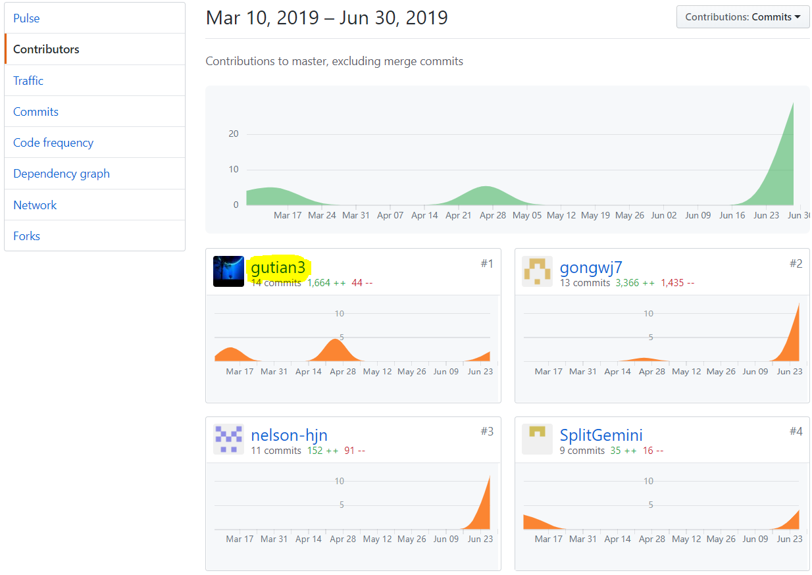

## 16340065	谷田

### 简短的课程学习自我总结

在这次课程项目中主要的工作是UI界面的设定，偶尔协助写一些文档以及会议记录。 在项目开发过程中，了解到项目开发的大致流程，包括需求分析，模块设计等，需求分析尽量详细的情况下才能更快的开发出产品。 也了解到开发的方法，快速完成第一次迭代后，可以根据需求或存在的问题调整结构。

**对同学帮助的致谢**

团队的成员都帮助了我很多，每个成员都很棒

- nelson-hjn
- SplitGemini
- gongwj7

### PSP 2.1 统计表

| PSP2.1                                | Personal Software Process Stages      | Time (%) Senior Student |
| ------------------------------------- | ------------------------------------- | ----------------------- |
| **Planning**                          | **计划**                              | 10                      |
| Estimate                              | 估计这个任务需要多少时间              | 10                      |
| **Development**                       | **开发**                              | 80                      |
| Analysis                              | 需求分析 (包括学习新技术)             | 15                      |
| Design Spec                           | 生成设计文档                          | 10                      |
| Design Review                         | 设计复审 (和同事审核设计文档)         | 5                       |
| Coding Standard                       | 代码规范 (为目前的开发制定合适的规范) | 4                       |
| Design                                | 具体设计                              | 15                      |
| Coding                                | 具体编码                              | 30                      |
| Code Review                           | 代码复审                              | 5                       |
| Test                                  | 测试（自我测试，修改代码，提交修改）  | 5                       |
| **Reporting**                         | **报告**                              | 5                       |
| Test Report                           | 测试报告                              | 1                       |
| Size Measurement                      | 计算工作量                            | 2                       |
| Postmortem & Process Improvement Plan | 事后总结, 并提出过程改进计划          | 5                       |

### 个人分支的 GIT 统计报告

### 自认为最得意/或有价值/或有苦劳的工作清单，含简短说明

学习了课表小程序的框架，实现课表登录页面交互逻辑，处理UI状态正确显示