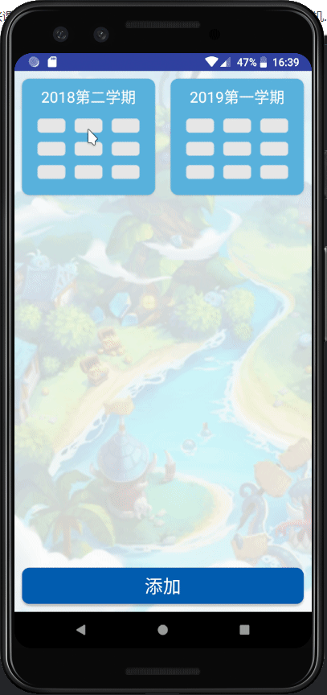
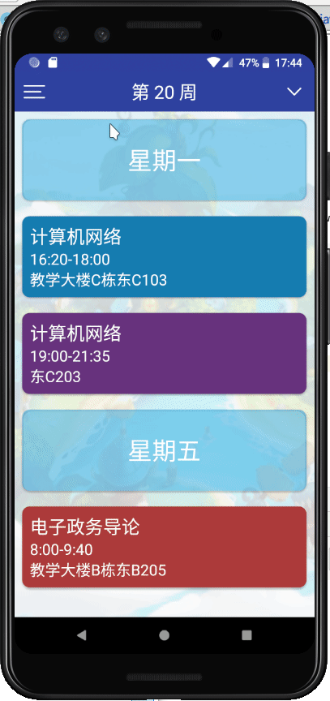
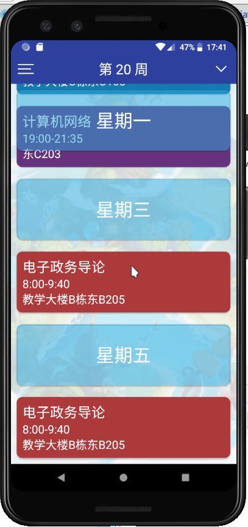
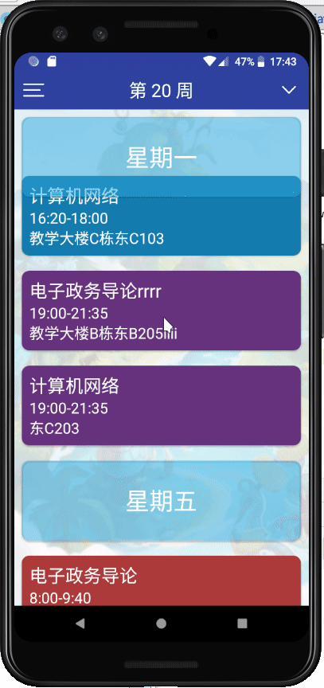
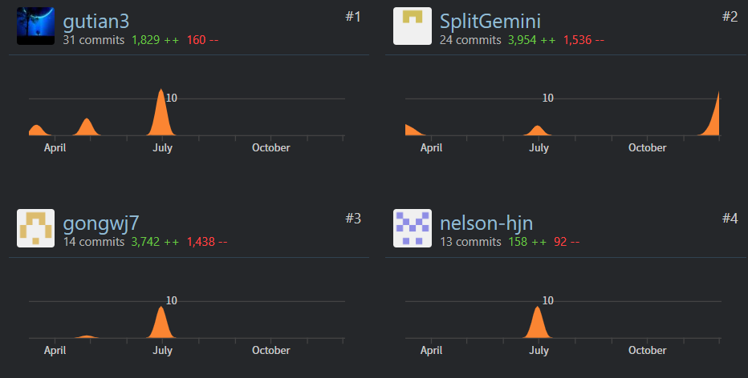
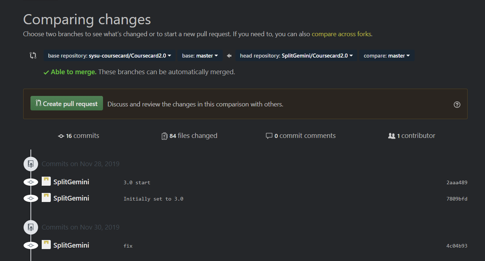
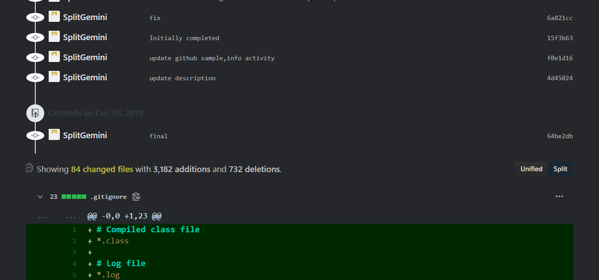

## 新内容更新详情

### 新内容：

1. 修复了很多问题，比如修复自动滚动到当前星期几的课的问题，学期保存问题，滚动函数数据越界问题，通知内容不对问题等等。原app还是挺容易崩溃的，经过大量的修修补补，现在的app比较稳定，因此可以看到这次更新代码改动其实很大
1. 数据库课程和笔记增加删除和更新函数；笔记数据添加对课程的外键，使笔记和课程绑定，增加安全减少冗余；删除了课程的unique标记，让课程内容可以重复
1. 网页获取从之前的只获取第1和第11周课程改为获取第1，10，11，20周课程
1. 网页获取增加稳定性，简化了读取json的内容，之前是每周的课程都存储在数据库，但是网络获取的仅仅是几周的课程，因此也只存储那几周的课程即可，解决了之前读取复杂json数据库崩溃的问题。同时UI读取和显示课程的逻辑也应做出相应改动
1. 主界面点击进入课程库列表的按钮改为一个下拉选项菜单，并对该下拉菜单进行基本UI设计和动画处理效果。可选择进入课程库列表、在该课程库添加课程，删除cookie三个选项
1. 添加自定义新课程功能，从左上角下拉菜单进入添加课程界面可见一门默认是”计算机网络“的课程，可对相关细节进行修改，包括面板上的所有课程属性，返回后自动创建
1. 课程库列表长按课程库item可选删除该课程库，所有属于该课程库学期的课程都将被删除
1. 添加修改课程功能，课程主界面长按对应课程item进入修改界面，修改和添加课程界面相同，可以修改面板上所有可见课程属性，返回后自动保存。可选删除该门课程，删除课程表根据课程Id删除，因此不会删除相同名称的其他课程，属于第1-10，10，11-19，20周的四种课程id不同
1. 添加点击通知可直接跳转进app功能
1. 修改了一些兼容性问题，比如rxjava1 -> rxjava2 ,修复已弃用，已过期的函数
1. 部分结构和逻辑已改变，比如读写notes将基于课程id而不是课程名等
1. 新增了通过Github读取json数据类，之前的通过教务系统读取json的类暂时失效，在此做保留处理

### 展示

新建课程库

删除课程库

新建课程

修改课程

删除课程

点击通知跳转

### 贡献

贡献，SplitGemini，后面还有几次修补commits，现在大概是4000 多additions，最新的变化见最下面的长图

对比原分支,16 commits, 84 files changed，这也不算是最新的，最新的可见与原分支的对比

对比原分支，3182 additions

### 问题

因为访问课程表的网络api在2019年12月1日已弃用，在没找到新的api前该课程表app功能性废了，目前获取的课程表皆为从GitHub上获取测试用课程表
[在这](https://github.com/SplitGemini/Coursecard2.0/tree/master/dashboard/new_content/sample)
就算不能自动获取课程表也能手动添加与删除，仍保留一定功能，而之前的版本就没有这个功能

如果想修改api，修改CASActivity->loadUrl来访问主页，CASActivity->setWebViewClient到MyWebViewClient，然后在MyWebViewClient->GithubService and MyWebViewClient->OnClick4Data里修改对应api

### details

变化详情长图

